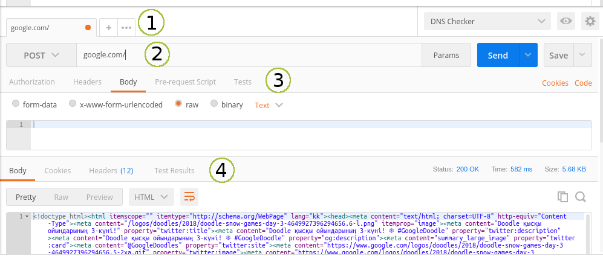
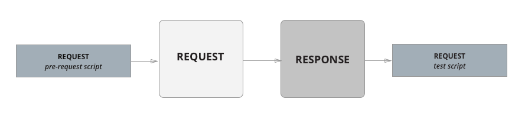
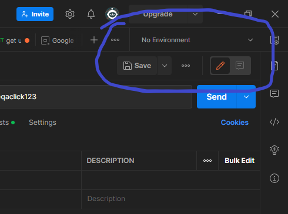
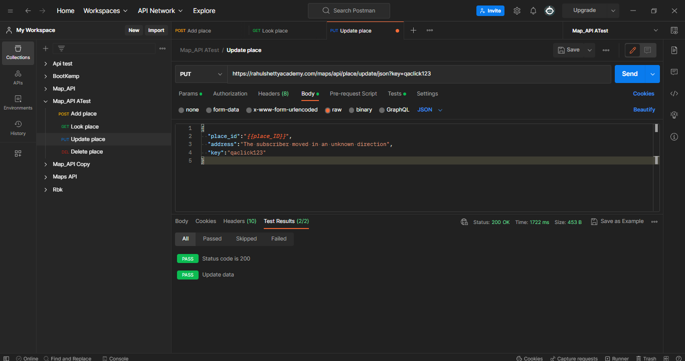
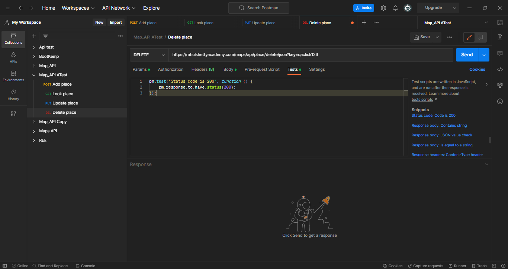
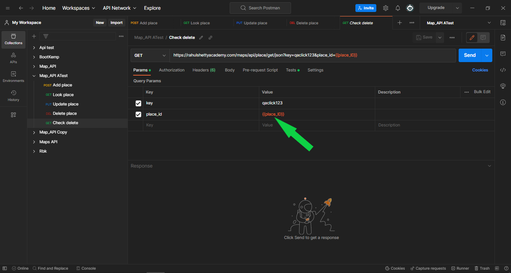

# Дипломная работа по специальности тестировщик на тему "Тестирование API"

***

## Дипломная работа состоит из:

## Введение.

## Теоретическая глава.

## Практическая глава.

## Заключение.

## Список использованных источников.

---

## Введение.

Тестирование API является важным этапом в разработке любого программного продукта. Это позволяет проверить работоспособность API, его соответствие стандартам и требованиям, а также обеспечить качество и надежность работы приложений, использующих данное API.

Целью данного дипломного проекта является разработка тестового набора для API, который будет покрывать основные функциональные возможности API. Для этого будут использоваться современные инструменты и технологии, а также методы автоматизированного тестирования.

В заключении будут подведены итоги проведенного тестирования API.

## Тестирование 

Немного истории тесрирования ПО:

Первые программные системы разрабатывались в рамках программ научных исследований или программ для нужд министерств обороны. Тестирование таких продуктов проводилось строго формализованно с записью всех тестовых процедур, тестовых данных, полученных результатов. Тестирование выделялось в отдельный процесс, который начинался после завершения кодирования, но при этом, как правило, выполнялось тем же персоналом.

В 1960-х много внимания уделялось «исчерпывающему» тестированию, которое должно проводиться с использованием всех путей в коде или всех возможных входных данных. Было отмечено, что в этих условиях полное тестирование программного обеспечения невозможно, потому что, во-первых, количество возможных входных данных очень велико, во-вторых, существует множество путей, в-третьих, сложно найти проблемы в архитектуре и спецификациях. По этим причинам «исчерпывающее» тестирование было отклонено и признано теоретически невозможным.

В начале 1970-х годов тестирование программного обеспечения обозначалось как «процесс, направленный на демонстрацию корректности продукта» или как «деятельность по подтверждению правильности работы программного обеспечения». В зарождавшейся программной инженерии верификация ПО значилась как «доказательство правильности». Хотя концепция была теоретически перспективной, на практике она требовала много времени и была недостаточно всеобъемлющей. Было решено, что доказательство правильности — неэффективный метод тестирования программного обеспечения. Однако, в некоторых случаях демонстрация правильной работы используется и в наши дни, например, приёмо-сдаточные испытания. Во второй половине 1970-х тестирование представлялось как выполнение программы с намерением найти ошибки, а не доказать, что она работает. Успешный тест — это тест, который обнаруживает ранее неизвестные проблемы. Данный подход прямо противоположен предыдущему. Указанные два определения представляют собой «парадокс тестирования», в основе которого лежат два противоположных утверждения: с одной стороны, тестирование позволяет убедиться, что продукт работает хорошо, а с другой — выявляет ошибки в программах, показывая, что продукт не работает. Вторая цель тестирования является более продуктивной с точки зрения улучшения качества, так как не позволяет игнорировать недостатки программного обеспечения.

В 1980-е годы тестирование расширилось таким понятием, как предупреждение дефектов. Проектирование тестов — наиболее эффективный из известных методов предупреждения ошибок. В это же время стали высказываться мысли, что необходима методология тестирования, в частности, что тестирование должно включать проверки на всем протяжении цикла разработки, и это должен быть управляемый процесс. В ходе тестирования надо проверить не только собранную программу, но и требования, код, архитектуру, сами тесты. «Традиционное» тестирование, существовавшее до начала 1980-х, относилось только к скомпилированной, готовой системе (сейчас это обычно называется системное тестирование), но в дальнейшем тестировщики стали вовлекаться во все аспекты жизненного цикла разработки. Это позволяло раньше находить проблемы в требованиях и архитектуре и тем самым сокращать сроки и бюджет разработки. В середине 1980-х появились первые инструменты для автоматизированного тестирования. Предполагалось, что компьютер сможет выполнить больше тестов, чем человек, и сделает это более надёжно. Поначалу эти инструменты были крайне простыми и не имели возможности написания сценариев на скриптовых языках.

В начале 1990-х годов в понятие «тестирование» стали включать планирование, проектирование, создание, поддержку и выполнение тестов и тестовых окружений, и это означало переход от тестирования к обеспечению качества, охватывающего весь цикл разработки программного обеспечения. В это время начинают появляться различные программные инструменты для поддержки процесса тестирования: более продвинутые среды для автоматизации с возможностью создания скриптов и генерации отчетов, системы управления тестами, ПО для проведения нагрузочного тестирования. В середине 1990-х годов с развитием Интернета и разработкой большого количества веб-приложений особую популярность стало получать «гибкое тестирование» (по аналогии с гибкими методологиями программирования).

Тестирование программного обеспечения — процесс исследования, испытания программного продукта, имеющий своей целью проверку соответствия между реальным поведением программы и её ожидаемым поведением на конечном наборе тестов, выбранных определённым образом.

В разное время и в различных источниках тестированию давались различные определения, в том числе:

* процесс выполнения программы с целью нахождения ошибок;
* интеллектуальная дисциплина, имеющая целью получение надежного программного обеспечения без излишних усилий на его проверку;
* техническое исследование программы для получения информации о её качестве с точки зрения определённого круга заинтересованных лиц (С. Канер[en] [уточнить]);
* проверка соответствия между реальным поведением программы и её ожидаемым поведением на конечном наборе тестов, выполненных определённым образом;
* процесс наблюдения за выполнением программы в специальных условиях и вынесения на этой основе оценки каких-либо аспектов её работы;
* процесс, имеющий целью выявление ситуаций, в которых поведение программы является неправильным, нежелательным или не соответствующим спецификации;
* процесс, содержащий в себе все активности жизненного цикла, как динамические, так и статические, касающиеся планирования, подготовки и оценки программного продукта и связанных с этим результатов работ с целью определить, что они соответствуют описанным требованиям, показать, что они подходят для заявленных целей и для определения дефектов.

Выделяют много видов и уровней тестирования, одним из них является тестирование API, о нём подробней я расскажу ниже.

## Тестирование API

Тестирование
API (Application Programming Interface) расшифровывается как “интерфейс прикладного программирования” или “интерфейс программирования приложений”. Он позволяет осуществлять связь и обмениваться данными между двумя отдельными модулями программы. Система программного обеспечения, реализующая API, содержит функции/подпрограммы, которые могут быть выполнены с помощью другого программного обеспечения.

"Общение" между модулями приложения происходит с использованием стандартных форматов XML и JSON и посредством специальных протоколов REST и SOAP.

Например, некое приложение, сервис предоставления данных о прогнозе погоды - имеет API, которым могут пользоваться разработчики. То, каким образом разработчики будут пользоваться, зависит от возможностей API. Например, может ли API выдавать данные о прогнозе погоды на неделю вперед, по каким городам мира выдаются данные, возможно ли запросить такие данные, как скорость ветра, давление и т.д.

Форматы данных

Как и говорилось выше, основные форматы, которые используются для передачи данных в API - это JSON и XML.

В JSON существуют типы данных, которые записываются по-разному. Данные в JSON записываются парами "Ключ":"Значение". Например:

    {“name”:”JamesKirk”}

Имя параметра — это строка в двойных кавычках слева от двоеточия.

    {“name”}

Значение — может быть строкой в двойных кавычках, числом, логическим значением (true или false), объектом, массивом, или значением null. Эти структуры могут быть вложены друг в друга.

    {”JamesKirk”}

Объект — это множество пар "Ключ":"Значение", заключённое в фигурные скобки { }. Между именем параметра и значением стоит двоеточие ":", а пары "Ключ":"Значение" разделяются запятыми “,”.

    {

    “name”:”JamesKirk”,

    "age":40

    }

Строка — это упорядоченное множество из нуля или более символов Unicode, заключенное в двойные кавычки.

Массив — это множество объектов. Массив заключается в квадратные скобки [ ], а значения отделяются запятыми (см. пример на изобрежнии выше).

В XML данные хранятся между так называемыми "тэгами".

Существуют открывающие и закрывающие тэги, а данные, в свою очередь, хранятся между ними.

Например:

< note> - открывающий тэг;

< /note> - закрывающий тэг.

Примечательно то, что тэги чувствительны к регистру. Другими словами, нельзя использовать открывающий тэг < MESSAGE> и закрывающий тэг < /message>. XML воспринимает это как разные тэги.

Более подробно о принципах построения XML можно изучить в официальной документации тут.

XML является более громоздким из форматов данных и все больше разработчиков API от него отказываются.

Понятие HTTP
HTTP (Hyper Text Transfer Protocol) – широко распространённый протокол передачи данных, изначально предназначенный для передачи гипертекстовых документов. По умолчанию используется 80-ый порт.

HTTPS (Hyper Text Transfer Protocol Secure)— безопасный протокол передачи гипертекста. Это расширение протокола HTTP, поддерживающее шифрование посредством криптографических протоколов SSL и TLS. По умолчанию используется 443-ий порт.

Спецификация HTTP (и HTTPS) определяет то, как запросы к серверу должны быть построены, и то, как сервер должен отвечать на эти запросы.

Основные свойства HTTP:

Не зависит от соединения. Для отправки запроса клиент устанавливает соединение с сервером и отсоединяется после отправки запроса. Сервер, в свою очередь, обрабатывает запрос и устанавливает соединение с клиентом для отправки ответа и отсоединяется после нее. Ни клиент, ни сервер не "знают" ничего о состоянии друг друга до начала соединения и после его окончания.
Не привязан к конкретному типу данных. Можно передавать любой тип данных при условии, что и клиент, и сервер способен работать с выбранным типом данных.
Взаимодействует только через соединение. Клиент и сервер могут взаимодействовать друг с другом только с помощью запроса. Из-за этой особенности ни клиент, ни сервер не могут получить информацию за пределами запроса.
Запросы HTTP

Клиент отправляет запрос на сервер в виде метода, URL и версии протокола, после которого идет некоторое сообщение, которое и содержит данные запроса.

Разберем подробнее каждую из частей запроса.

Method (метод) - это действие, которое мы хотим произвести над ресурсом на сервере. Их достаточно большое количество, но выделим основные 4:

GET - предназначен для получения ресурса с сервера;
POST - отправляет данные на сервер с созданием новой записи;
PUT - отправляет данные на сервер с перезаписью существующей записи;
DELETE - удаляет данные ресурса.

Request URI - строка запроса, которая содержит последовательность символов к ресурсу, а также (опционально) параметры запроса, которые могут передаваться прямо в строке запроса (например, для GET).

Для передачи параметров в строке запроса необходимо следовать ряду определенных правил:

Параметры отделяются от адреса символом "?".
Каждый параметр задается парой "Ключ" и "Значение".
"Ключ" и "Значение" разделены между собой символом "=".
При необходимости задать несколько параметров в одной строке запроса, они отделяются друг от друга символом "&".
Например, в строке запроса http://example.com/path/to/page?name=ferret&color=purple:

http://example.com/ - базовый адрес (base URL), с которого будут начинаться все запросы;
/path/to/page - путь к ресурсу относительно базового адреса;
Параметр name со значением ferret;
Параметр color со значением purple.
Стоит отметить, что данные в строке запроса должны передаваться в специальной кодировке - URL Percent Encoding. Таким образом, чтобы передать в строке запроса, например, символы кириллицы, необходимо перевести их в этот формат. В сети существует множество инструментов, позволяющих легко перевести строку запроса в нужный формат.

Protocol version - версия протокола HTTP (практически всегда используется HTTP/1.1).

Headers (заголовки или "хедеры") - часть запроса, в которой хранится необходимая для выполнения запроса информация от клиента.

Заголовки представляют пары "Ключ":"Значение". Они содержат различную информацию о HTTP-запросе и Вашем браузере. Например, строка "User-Agent" предоставляет информацию о версии браузера и операционной системе, которую Вы используете. "Accept-Encoding" сообщает серверу, может ли Ваш браузер принимать сжатый output, например, gzip.

В свою очередь, ответ сервера так же содержат заголовки. Эти значения могут содержать информацию о софте сервера при последнем изменении страницы/файла и прочее. Опять же, большинство этих headers на самом деле являются необязательными.

Кроме этого, сервер отправляет так же код состояния (statuscode) ответа. Коды состояния делятся на 5 групп:

* 1хх	Информационные
* 2хх	Успешные
* 3хх	Перенаправление
* 4хх	Ошибки клиента
* 5хх	Ошибки сервера
Полный список кодов ошибок из каждой группы и их описание можно посмотреть тут: http://www.restapitutorial.ru/httpstatuscodes.html.

Body (тело запроса) - опциональное поле, в котором передается вся необходимая информация, которую нужно передать на сервер.

Рассмотрим выполнение запросов на примерах.

Общим предусловием для всех примеров будет наличие сайта https://reqres.in, который позволяет производить различного рода действия над пользователем. В данном случае, https://reqres.in - это базовый адрес (base URL), к которому будут добавляться пути к ресурсам.

GET запрос. Имеет функцию получения списка пользователей. Задача данной функции - отображать список пользователей по три записи на странице.

    GET /api/users?page={page_number}

Получим список пользователей для второй страницы:

Как мы видим, в поле ниже мы получили ответ в формате JSON, который содержит 3 записи о пользователях.

POST запрос. Функция используется для входа в приложение и возвращает ответ со значением токена авторизации.

    POST /api/login

Параметры тела запроса:

email – новое имя пользователя;

password – новая профессия пользователя.

Вызов функции и ответ сервера будет выглядеть таким образом:

В данном примере строка запроса не содержит параметров. Body запроса же в свою очередь содержит два параметра - email и password. Ответ функции содержит Body с токеном авторизации пользователя.

PUT запрос. Функция изменения данных пользователя. Возвращает ответ с измененными данными пользователя и датой изменения.

    PUT /api/users/{user_id}

Параметры тела запроса:

name – новое имя пользователя;

job – новая профессия пользователя.

Подставив параметры в URI и тело запроса, получим:

DELETE запрос. Функция удаления данных пользователя. Функция возвращает пустой ответ и код 204 (No Content)

    DELETE /api/users/{user_id}

Тело запроса не содержит данных.

Подставив нужный идентификатор пользователя в строку запроса, удалим его данные:

### REST
REST (Representational state transfer) - подход к разработке клиент-серверных приложений.

Приложения на REST архитектуре должны быть:

Клиент-серверными.
Взаимодействие между клиентом и сервером должно быть на HTTP.
Все операции над ресурсами указываются в самих запросах. В архитектуре REST все данные являются "ресурсами" Все, что необходимо сделать с ресурсом в архитектуре REST, несется в самом запросе.
Stateless – состояние клиента не сохраняется на сервере. Каждый раз, при обращении клиента к серверу, сервер воспринимает клиента как нового. Для аутентификации клиента на сервере могут использоваться cookies, например: сookies предоставляет дополнительную информацию от клиента пользователю (позиции в корзине пользователя в интернет-магазине).
Возможность работать с любыми форматами данных (json, xml, text…).
### SOAP
SOAP (Simple Object Access Protocol) является стандартизированным протоколом передачи сообщений между клиентом и сервером. Обычно он используется совместно с HTTP(S), но может работать и с другими протоколами прикладного уровня (например, SMTP и FTP).

В отличие от REST, который может использовать любые форматы данных, SOAP работает только с XML форматом. При работе всегда удобно иметь стандартизированное описание возможных XML-документов и проверять их на корректность заполнения. Для этого существует XML Schema Definition (или сокращенно XSD). Две главные функции XSD для тестировщика – это описание типов данных и наложение ограничений на возможные значения. Например, некоторые элементы ответов сервера можно сделать необязательным для заполнения или ограничить его размер 255 символами с помощью XSD. Чем подробнее описан XSD, тем меньше головной боли доставит Вам тестирование сервиса. С помощью выстроенной схемы сервис сам сможет валидировать полученные данные и возвращать пользователю ошибку. Подробнее прочитать про XSD можно на w3schools и codenet (по-русски).

### WSDL
(Web Services Description Language) – это язык на основе XML, который используется для описания веб-сервисов. В WSDL-документе содержится информация о местонахождении сервиса и доступных методах (операциях). Для каждого метода определяются параметры отправляемого и получаемого сообщения. Обратите внимание на то, что XSD может быть «встроен» внутрь WSDL-документа (например, у Yandex Speller API).

Типы тестов, применимые к тестированию API
В целом, к тестированию API применимы следующие типы тестов:

* Функциональное тестирование – тесты должны выполнить набор вызовов, задекларированных в API, чтобы проверить общую работоспособность системы.
* Usability-тестирование – проверяет, является ли API функциональным и обладает ли удобным интерфейсом, также проверяется интеграция с другими.
* Тестирование безопасности – проверяет используемый тип аутентификации и шифрование данных с помощью HTTP.
* Автоматизированное тестирование – создание скриптов, программ или настройка приложений, которые смогут тестировать API на регулярной основе.
* Тестирование документации– проверяется полнота описаний функций API, её понятность.

При тестировании API необходимо проверять следующие моменты:

1. Правильный ли метод используется для того или иного запроса?
2. Проверяйте, что клик по одной и той же кнопке вызывает один и тот же запрос.
3. Вникайте в отправляемые запросы. Анализ запросов – это возможность обнаружить спрятавшийся дефект гораздо быстрее, чем осуществляя его поиск в интерфейсе.
4. Мониторьте трафик на предмет запросов на другие сервера.
5. Внимательно следите за кодами состояний

С помощью тестирования API можно обнаружить следующие типы ошибок:

- Сбой обработки ошибочных условий при передаче корректных и некорректных данных в запросах.
- Неиспользуемые флаги в параметрах запросов.
- Отсутствующая или дублирующаяся функциональность.
- Вопросы надежности: трудности при подключении и получении ответа от API.
- Проблемы с безопасностью.
- Проблемы многопоточности.

Лучшие практики тестирования API:

* Тест-кейсы должны быть сгруппированы по тестовым категориям.
* Каждый тест должен включать декларацию тестируемой функции.
* Выбор параметров должен быть явно упомянут в самом тесте.
* Установка приоритетов вызова функций API.
* Каждый тест должен быть самодостаточным и независимым друг от друга.
* Особую осторожность следует соблюдать при обращении к функциям удаления, закрытия окна и прочим.
* Вызов последовательности действий должен быть хорошо спланирован и выполнен.
* Для обеспечения полного тестового покрытия создавайте тестовые случаи для всех возможных комбинаций входных данных.

Так же мы можем использовать такие общепринятые техники, как анализ граничных значений и разбиение на классы эквивалентности. В API запросах в явном виде могут передаваться значения параметров. Это отличный повод выделить границы входных и выходных значений и проверить их. Даже у небольшого API есть множество вариантов использования и множество комбинаций входных и выходных переменных. Поэтому мы можем лишний раз использовать наши навыки выделения эквивалентных классов.

Тестирование API обладает рядом преимуществ перед обычным тестированием через UI:

* Точное понимание, где происходит ошибка и чем она вызвана.
* Тратится меньше времени на подготовку тестовых данных.
* Возможно выполнение тестов на больших объемах данных с приемлемой скоростью.
* Можно начать тестирование на ранних этапах, когда еще нет интерфейса

Проблемы, с которыми сталкиваются тестировщики при работе с API:

* Комбинация и выбор параметров.
* Отсутствие графического интерфейса.
* Валидация и верификация выходных данных в разных системах.
* Обязательная проверка обработки исключений.
* Тестировщикам необходимы знания в программировании.

## Postman - приложение для тестирования API.

Основное предназначение приложения — создание коллекций с запросами к вашему API. Любой разработчик или тестировщик, открыв коллекцию, сможет с лёгкостью разобраться в работе вашего сервиса. Ко всему прочему, Postman позволяет проектировать дизайн API и создавать на его основе Mock-сервер. Вашим разработчикам больше нет необходимости тратить время на создание "заглушек". Реализацию сервера и клиента можно запустить одновременно. Тестировщики могут писать тесты и производить автоматизированное тестирование прямо из Postman. А инструменты для автоматического документирования по описаниям из ваших коллекций сэкономят время на ещё одну "полезную фичу". Есть кое-что и для администраторов — авторы предусмотрели возможность создания коллекций для мониторинга сервисов.
Главные понятия, которыми оперирует Postman это Collection (коллекция) на верхнем уровне, и Request (запрос) на нижнем. Вся работа начинается с коллекции и сводится к описанию вашего API с помощью запросов. Давайте рассмотрим подробнее всё по порядку.

Коллекция (Collection) — отправная точка для нового API. Можно рассматривать коллекцию, как файл проекта. Коллекция объединяет в себе все связанные запросы. Обычно API описывается в одной коллекции, но если вы желаете, то нет никаких ограничений сделать по-другому. Коллекция может иметь свои скрипты и переменные, которые мы рассмотрим позже.

Папка (Folder) — используется для объединения запросов в одну группу внутри коллекции. К примеру, вы можете создать папку для первой версии своего API — "v1", а внутри сгруппировать запросы по смыслу выполняемых действий — "Order & Checkout", "User profile" и т. п. Всё ограничивается лишь вашей фантазией и потребностями. Папка, как и коллекция может иметь свои скрипты, но не переменные.

Запрос (Request) — основная составляющая коллекции, то ради чего все и затевалось. Запрос создается в конструкторе. Конструктор запросов это главное пространство, с которым вам придётся работать. Postman умеет выполнять запросы с помощью всех стандартных HTTP методов, все параметры запроса под вашим контролем. Вы с лёгкостью можете поменять или добавить необходимые вам заголовки, cookie, и тело запроса. У запроса есть свои скрипты. Обратите внимание на вкладки "Pre-request Script" и "Tests" среди параметров запроса. Они позволяют добавить скрипты перед выполнением запроса и после. Именно эти две возможности делают Postman мощным инструментом помогающим при разработке и тестировании.

1 — вкладки с запросами, 2 — URL и метод, 3 — параметры запроса, 4 — параметры ответа

Скрипты

"Postman Sandbox" это среда исполнения JavaScript доступная при написании "Pre-request Script" и "Tests" скриптов. "Pre-request Script" используется для проведения необходимых операций перед запросом, например, можно сделать запрос к другой системе и использовать результат его выполнения в основном запросе. "Tests" используется для написания тестов, проверки результатов, и при необходимости их сохранения в переменные.

Последовательность выполнения запроса (из оф. документации)

Помимо скриптов на уровне запроса, мы можем создавать скрипты на уровне папки, и, даже, на уровне коллекции. Они называются также — "Pre-request Script" и "Tests", но их отличие в том, что они будут выполняться перед каждым и после каждого запроса в папке, или, как вы могли догадаться, во всей коллекции.

Последовательность выполнения запроса со скриптами папок и коллекций (из оф. документации)

Переменные

Postman имеет несколько пространств и областей видимости для переменных:

* Глобальные переменные
* Переменные коллекции
* Переменные окружения
* Локальные переменные
* Переменные уровня данных

Глобальные переменные и переменные окружения можно создать, если нажать на шестеренку в правом верхнем углу программы. Они существуют отдельно от коллекций. Переменные уровня коллекции создаются непосредственно при редактировании параметров коллекции, а локальные переменные из выполняемых скриптов. Также существуют переменные уровня данных, но они доступны только из Runner, о котором мы поговорим позже.

Приоритет пространств переменных (из оф. документации)

Особенностью переменных в Postman является то, что вы можете вставлять их в конструкторе запроса, в URL, в POST параметры, в Cookie, всюду, используя фигурные скобки в качестве плейсхолдера для подстановки.

{{domain}} и {{slack_incoming_webhook}} — переменные окружения DNS Checker будут заменены на значения во время выполнения запроса

Из скриптов переменные тоже доступны, но получить их поможет вызов стандартного метода встроенной библиотеки pm:

// получить глобальную переменную

    pm.globals.get("variable_key");

// получить переменную из окружения

    pm.environment.get("variable_key");

// получить переменную из любого пространства согласно приоритету

    pm.variables.get("variable_key");

Collection Runner

Предназначен для тестирования и выполнения всех запросов из коллекции или папки, на ваш выбор. При запуске можно указать количество итераций, сколько раз будет запущена папка или коллекция, окружение, а также дополнительный файл с переменными. Стоит упомянуть, что запросы выполняются последовательно, согласно расположению в коллекции и папках. Порядок выполнения можно изменить используя встроенную команду:

// Следующим выполнится запрос с названием "Create order",
postman.setNextRequest('Create order');

После выполнения всех запросов формируется отчет, который покажет количество успешных и провальных проверок из скриптов "Tests".

Информация взята с сайта https://habr.com/ru/company/kolesa/blog/351250/

для тестирования API необходимо само API  и наличие документации от разработчиков. Для успешного тестирования нам нужно от разработчиков получить какие запросы нужно отправлять и какие ответы мы должны получить. Значит нам небходимо знать ендпоинты, какие запросы, какие ответы.

Для примера тестирования API рассмотрим данные предоставленные одним очень хорошим человеком.
Важные атрибуты документации примера для тех, кто захочет повторить самостоятельно:

* Base URL:  https://rahulshettyacademy.com    
* Обязательный параметр для всех запросов: key = qaclick123
* POST:
* Resource: /maps/api/place/add/json
* Sample Body:

{

  "location": {
    "lat": -38.383494,
    "lng": 33.427362
  },
  "accuracy": 50,
  "name": "Frontline house",
  "phone_number": "(+91) 983 893 3937",
  "address": "29, side layout, cohen 09",
  "types": [
    "shoe park",
    "shop"
  ],
  "website": "http://google.com",
  "language": "French-IN"
}

* GET:
* Resource: /maps/api/place/get/json
* Query Parameters: key,  place_id ( place_id  value comes from Add place response)

* PUT:
* Resource: /maps/api/place/update/json
* Sample Body:

{

  "place_id":"8d2573bdf6ceec0e474c5f388fa917fb",
  "address":"70 Summer walk, USA",
  "key":"qaclick123"

}

* DELETE:
* Resource: /maps/api/place/delete/json
* Sample Body:

{
    "place_id":"928b51f64aed18713b0d164d9be8d67f"
}

В этих данных мы будем взаимодействовать с картой ГуглМапс.
 
 Начнем работать с постман. Создадим новую коллекцию с названием Map_API (карта).

 .png)

 Первым действием нажимаем NEW, и в появившемся окне пишем название нашей коллекции, в нашем случае "Map_API".

 Поскольку мы работаем с картой, то добавлять и изменять мы будем какое-то место на ней. Для этого создадим  запрос (reguest). 

 Первым делом нужно добавить место на карте.
 
 .png) 

 1. Создадим запись на сервере, для этого отправим запрос именуемый POST (выбирается из списка), и назовём его "Add place".
 2. Из выше перечислинных данных нам нужен базовый URL и ресурс. Копируем и вставляем в адресную строку, без пробелов.
3. Пишем  ключ - KEY и его значение - qaclick123.
4. Открываем вкладку Body. Нажимаем кнопку 'raw', после в списке справа выбираем JSON.

.png) 

5. В открывшееся окно вставляем весь код нашего JSON-а.
6. Обязательно сохраняем кнопкой SAVE.
7. И отправляем наш запрос нажав Send.
 
 

 И смотрим на результат.

 .png)

 В ответе мы получили статус ОК, код 200, и наш идентификатор "place_id", который мы будет использовать в следующих операциях.

 Теперь самое время проверить правда ли создалась наша запись. Для этого создадим новый запрос, который  называется GET.

 .png)

 1. Нажимаем на меню.
 2. Находим сторку Add request и нажимаем её. И у нас открывается новое окно.

 .png)

 1. Пишем название нашего запроса, я назвал его "Look place".
 2. Далее вводим наш ключ и его значение.
 3. Теперь у нас появляется новый ключ - place_id ( который мы получили в ответе на первый запрос POST),  значение этого ключа копируем из ответа и вставляем.
 4. Сохраняем.
 5. Отправляем запрос.

 В ответе мы должны увидеть те же самые параметры, которые отправили в теле запроса.

 .png) 

 Смотрим на полученный ответ и сравниваем с отправленым запросом POST. Как видим всё совпало, значит всё прошло правильно.

 Теперь пришло время внести изсенения в нашу точку. Для изменения каких-либо значений в ранее созданый запрос POST применяется запрос именуемый - PUT.

 Начнём:

 .png)
1. Создаем навый запрос и назовем его "Update place".
2. Во вкладке Body нажымаем кнопку row.
3. В списке выбираем JSON.

.png)

.png)

4. В тело вставляем код, не забываем поменять значение place_id, на наш!!!
5. Нажимаем сохранить.
6. Отправляем запрос.

.png)

Смотрим полученный ответ с сервера. Статус 200, в тексте сказано, что адрес изменился. Всё прошло успешно!

Дальше для подтвержления того, что данные действительно изменились мы можем ещё раз запустить запрос GET.
Открываем вкладку GET смотрим какой ответ был получен.

.png)

Как мы видим адрес указан  "29, side layout, cohen 09". Теперь нажимаем кнопку "SEND" и смотрим на адрес в ответе.

.png)

В ответе мы получили "70 Summer walk, USA", адрес  изменился - значит мы всё сделали правильно и система отработала. PUT запрос прошел правильнно.

Теперь можно провести последний запрос DELETE.

.png)

1. Создаём новый запрос и называем его "Delete place".
 Из нашего списка данных берем базвый URL и ресурс для Delete, и всё вставляем в строку запроса.
2. Указывам наш ключ - Key  и его значение - qaclick123.
3. Открываем вкладку "Body"

.png)

4. Вставляем JSON, не забываем поменять занчение "place_id" на наш!!!
5. Нажимаем Save.
6. Отправляем запрос кнопкой SEND.

.png)

Смотрим полученный ответ.
Получили "status: OK". Всё нашей точки на карте больше нет. Запрос прошел удачно!

Таким образом мы протестировали API, он работает без ошибок, все молодцом!
 

Постман может автомаризировать выполнение написаных тестов. Для этого нужно выполняить ряд определенных действий. 

Я опишу по порядку их выполнение, на основе первого теста. 

Делаю копию коллекции

Заходим во вкладку TEST

.png)

После этого ищем в правой части список снипетов, и выбираем там 

        Status code: Code is 200

Т.к. подтверждение того, что проверка прошла успешно именно код 200. После этого в поле Test появится некая функция на языке JavaScript.

.png)

Расшифруем первую строку:

1. pm - это объект в постман.

2. test - это метод в постман, в нашем случае сам тест, который проверяет появится ли код 200, или нет.

3. "Status code is 200" - это название теста, оно ни на что не влияет, названия исключительно для пользователя.

4. function - это есть функция, которая будет проверять получим мы код 200 или нет, если нет то она сообщит нам об ошибке. 

  Во второй строке в скобках указана цифра 200, её можно изменить на любое значения и в случае успешного выполнения теста, т.е. мы должны получить код 200, но мы получим ошибку. Значит функция работает.

Для запуска теста нужно нажать синюю кнопку SEND. После выполнения открыть вкладку Test rezults и мы видим результат прохождения теста наш код 200 со значением PASS, значит всё прошло удачно.

.png)

Так же в ответе во вкладке "Body" мы получили новый "place_id", который будем использовать в дальнейшем.

.png)

В предыдущих тестах мы меняли id, для выполнения запросов к API. Теперь параметр "place_id" будет для нас новой переменной. 

Для автоматизации созданного ранее теста в постман. Где необходимо менять какие-то данные нам нужно добавить пременнную через инструмент 

        Environment (Окружение)
 
 который находится в правом верхнем углу постман.

 

 Для удобства и для исключения путанницы, я переименовал копию коллекции и создал "Окружение" с таким же названием, и в нём создал переменную "place_ID". 

 .png)

Для обработки полученных данных из вкладки "Body" в ответе есть сниппед:

         Resnopce Body: JSON value chek

*Очень **ВАЖНЫЙ** момент* : следите за курсором на поле ввода текста, т.к. код сниппеда появится именно там, где будет стоять курсор.

.png)

С помощью // закомитем не нужную нам строку (1).

Переименуюем название функции (2).

.png)

Назовём её "Set variable"

.png)

Теперь рассмотрим, что мы можем с помощью данного снипеда:

1 pm.responce.json()   --- это то, что мы можем получить из ответа в формате JSON

2 var jsonData   --- это то, что можно положить в переменную.

В общем мы получаем ответ, берем из него значение и записываем в переменную.

Идём далее. 

.png)

1 Для добавления нового (приходящего) значения в переменную, добавим в код новую сторку:

        Set an environmetn variable

2 Меняем значение "variable_key" на "place_ID"

3 Вместо - "variable_value", пишем -  jsonData.place_id

 После нажимаем кнопку "Send"  и смотрим на полученный ответ, а точнее на значение ключа "place_id".

 

 1 Теперь открываем вкладку "Окружение"

 Сравниваем значение, созданой нами, переменной, с полученным значением "place_id".
 
 

Убедились, что всё работает.

Теперь у нас есть переменная, с которой  можно работать дальше.

Дальше мы будем создавать запрос "Get", чтобы проверить создалась ли запись.

Открываем вкладку Get  и меняем зачение ключа "place_id"

Пишем название нашей переменной из "Окружения" в двойных фигурных скобках:

        {{place-ID}}

При наведении курсора на значение в фигурных скобках появляемся модальное окно, в котором отображается зеленый значек и описание переменной с её значением. Значит сделали всё правильно!

Теперь открываем вкладку "Tests"  и добавляем два снипеда:

        Status code: Code is 200

        Responce body: JSON value check

Для проверки на правильно созданную запись мы будем проверять значения адреса отправленного при регистрации запросом "POST"

Для этого будем использовать следущую строку:

Ключ "address"  и его значение "Address from Russia", мы возьмем из вкладки "Body" запроса "POST"

Копируем их в строку кода запроса "GET":

Изменим название теста:

Проверяем правильность заполнения данных, нажимаем "SAVE" и  "SEND".

Получаем положительный код 200, в ответе наш адрес.

В вкладке "Test" получили две проверки со значение "PASS", что говорит о положительно пройденом тесте.

Далее будем офомлять запрос "PUT". Как мы помним этот запрос отправляется для изменения данных  ранее отправленного запроса "POST", а значит будем оправлять некоторые данные изпользованные раньше.

Открываем вкладку запроса "PUT"

Во вкладке "Body" меняем значение ключа "place_id" на нашу переменную.
Значение ключа -- "address" меняем на -- "The subscriber moved in an unknown direction" ( хотя не обязательно).

Во вкладке "Тest" запроса, довабляем два наших спиннеда 

        Status code: Code is 200

        Responce body: JSON value check

И применим его для создание теста проверки прохождения теста

Меняем название теста на "Update data" и по аналогии предыдущего запроса меняем значения в коде на результат ответа по запросу "PUT" из первого набора тестов:

        "msg": "Address successfully updated"

.png)

Нажимаем "SAVE" и "SEND"

Получили статус 200 и наш ответ.

Получили положительный итог.

Далее создаём запрос "DELETE".

Открываем вкладку запроса "DELETE", и во вкладке "Test" добавляем сниппед 

        Status code: Code is 200

Далее во владке "Body"  пишем в значение нашу переменную 

Полсе удаления нужноубедится, что данные удалены. Для этого создаём запрос "GET". Меняем название на "Check delete"

Во вкладке "Params" в занчение ключа "place_id" пишем нашу переменную:

Во вкладке "Test"  добавляем сниппед 

        Status code: Code is 200

только вместо 200, мы ждём код 404, т.к. данной точки быть не должно и мы ожидаем ошибку с сервера.

Нажимаем "SAVE" и "SEND".

Теперь у нас всё готово к запуску теста в автоматическом режиме!

Для этого запустим нашу коллекцию:

И смотрим результат автотеста:

Таким образом можно создавать коллекции тестов и запускать автоматическую проверку, что ускоряет проверки и делает их более эффективными.

## Заключение:
В рамках данного дипломного проекта была рассмотрена тема тестирования API. Были изучены основы API тестирования, его преимущества и недостатки, а также способы автоматизации API тестирования с помощью инструмента Postman. Была проведена практическая работа по тестированию API на примере веб-сервиса. Данная работа доказывает, что тестирование API является важным этапом в разработке веб-приложений и может быть автоматизировано, что увеличит эффективность тестирования.

## Список исползованных источников:

https://gb.ru/posts/kak-testirovat-api-ili-postman-dlya-chajnikov

https://habr.com/ru/companies/ingos_it/articles/670730/

https://logrocon.ru/news/api_testing

https://sergeygavaga.gitbooks.io/kurs-lektsii-testirovanie-programnogo-obespecheni/content/lektsiya-8-ch1.html

https://www.youtube.com/@QASTARTUPITTrainingCenter

